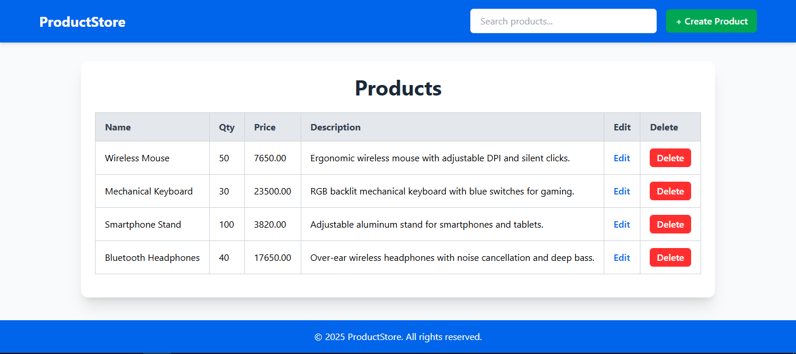
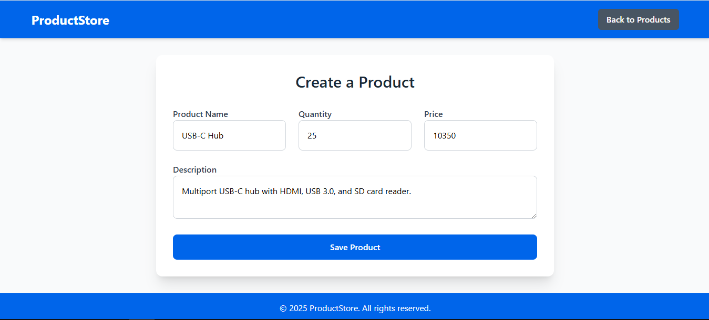
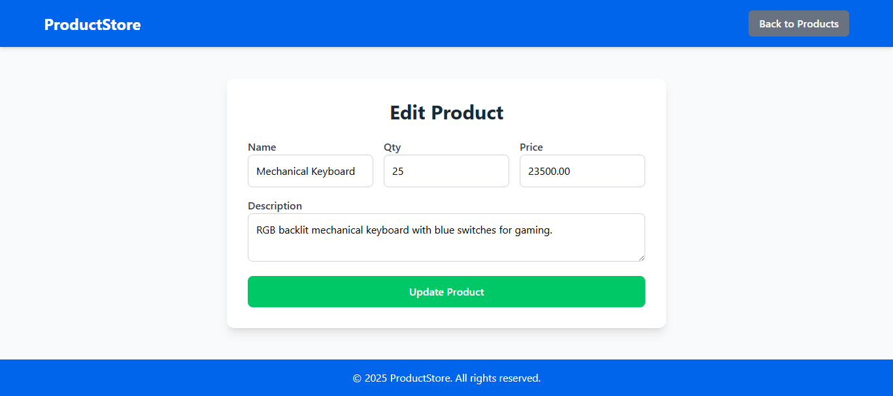

# Simple Laravel CRUD Project

This is a simple Laravel CRUD (Create, Read, Update, Delete) project to demonstrate basic operations with Laravel.

## Features

- Create, Read, Update, and Delete records
- Laravel Blade templating
- Bootstrap & Tailwind CSS for styling
- Eloquent ORM for database interactions
- Validation for form inputs

## Installation

Follow these steps to set up the project:

1. **Clone the repository**
   ```sh
   git clone https://github.com/saveen99/simple-laravel-CRUD.git
   cd simple-laravel-CRUD

2. **Install dependencies**
   ```sh
   composer install
   ```
   ```sh
   npm install

3. **Copy the environment file and configure**
   ```sh
   cp .env.example .env

4. **Generate application key**
   ```sh
   php artisan key:generate

5. **Set up the database**

7. **Run migrations**
   ```sh
   php artisan migrate

8. **Serve the application**
   ```sh
   php artisan serve

## Usage
- Navigate to http://127.0.0.1:8000/
- Perform CRUD operations on records.

## Screenshots






## Technologies Used
- Laravel
- MySQL / SQLite
- Bootstrap / Tailwind CSS
- Blade Templating

## License
This project is licensed under the [MIT License](LICENSE).
